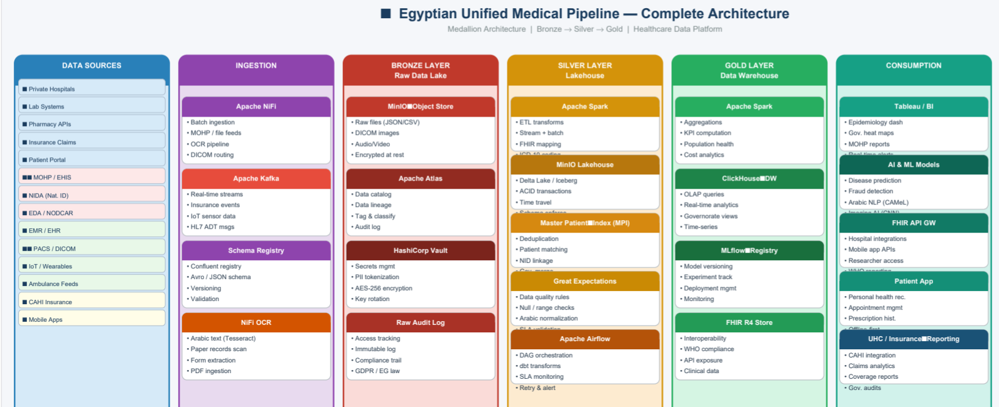
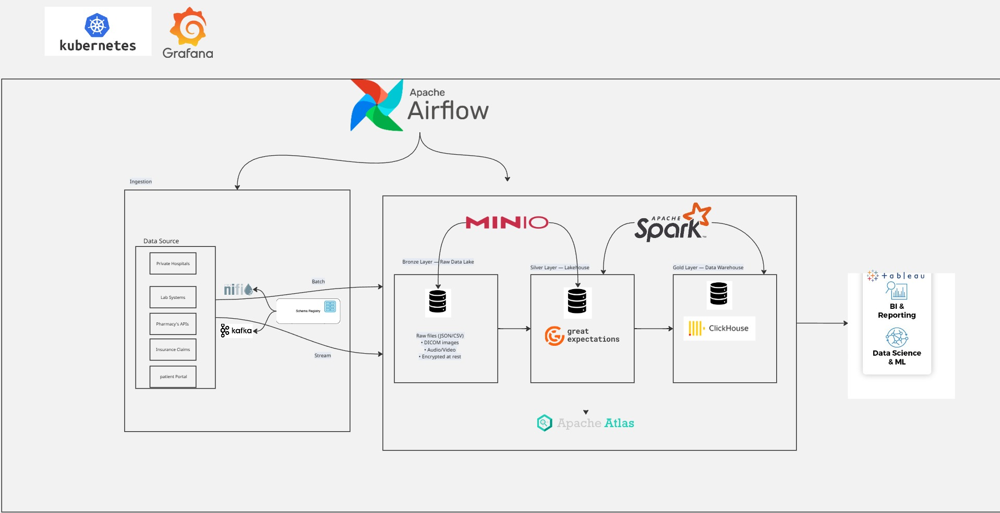

# 🏥 MedLink Egypt — Egyptian Unified Medical Data Pipeline

> A synthetic healthcare data pipeline for AI-ready patient records, built for the Egyptian medical ecosystem.

---

## 🗺️ Complete Architecture



*Medallion Architecture | Bronze → Silver → Gold | Healthcare Data Platform*

---

## 🔬 Pipeline Flow



The pipeline follows a **Medallion Architecture** using Apache Airflow for orchestration, flowing data from raw ingestion through Bronze, Silver, and Gold layers before reaching BI and ML consumers.

---

## 📁 Project Structure

```
medlink/
├── PipelineDemo.py            # Synthetic data generation + pipeline (combined)
├── medlink_db.py              # SQLite database layer (read/write patients & AI results)
├── medlink_orchestrator.py    # Orchestrator: runs all steps in order
├── output/
│   ├── medlink_patients_clean.parquet   # ML training / feature engineering
│   ├── medlink_patients_clean.csv       # EDA / spreadsheet use
│   ├── medlink_context.json             # LLM context injection (one record per patient)
│   └── medlink_chunks.jsonl             # RAG / embedding pipelines
└── medlink.db                 # SQLite database (auto-generated)
```

---

## ⚙️ Installation

```bash
pip install pandas numpy faker pyarrow tqdm
```

---

## 🚀 Usage

### 1. Generate synthetic data + run full pipeline
```bash
python PipelineDemo.py --out_dir ./output
```

### 2. Load CSVs from disk instead of generating
```bash
python PipelineDemo.py --from_csv ./data --out_dir ./output
```

### 3. Run the full orchestrator (pipeline → DB load → AI team notification)
```bash
python medlink_orchestrator.py --data_dir ./data
```

### 4. Reload DB only (skip pipeline, use existing output)
```bash
python medlink_orchestrator.py --db_only --out_dir ./output
```

### 5. Store AI model results when your AI team sends them back
```bash
python medlink_orchestrator.py --ai_results_file ai_team_output.json
```

### 6. Look up a patient by National ID
```bash
python medlink_db.py --lookup 3640201001
```

---

## 🗄️ Database Schema

| Table | Description |
|---|---|
| `patient_records` | Demographics, diagnoses, risk scores, lab results, clinical narrative |
| `ai_results` | AI model predictions linked to each patient (flexible JSON) |

---

## 📊 Data Generated

| Dataset | Rows | Description |
|---|---|---|
| Patients | 100,000 | Demographics, National ID, governorate |
| Diseases | 100,000 | Obesity, Diabetes, Hypertension, CVD, CKD flags |
| Labs | up to 1,000,000 | Visit-level lab results (glucose, cholesterol, BP, eGFR, etc.) |
| Family History | ~300,000 | Relative disease history per patient |

---

## 🧠 AI Artifacts

- **`.parquet`** — Use with pandas / sklearn / XGBoost pipelines
- **`.jsonl`** — Ingest into vector DBs (Pinecone, Weaviate, Chroma)
- **`.json`** — Direct LLM prompting with patient context

---

## 🗺️ Covered Governorates

Cairo · Giza · Alexandria · Dakahlia · Aswan · Luxor · Assiut · Fayoum · Minya · Suez · Port Said · Damietta · Sharkia · Gharbia · Menofia · Qalyubia · Beheira · Kafr El Sheikh · Matrouh · Red Sea · South Sinai · North Sinai · Sohag · Qena · Beni Suef · New Valley · Ismailia

---

## 🔒 Notes

- All patient data is **100% synthetic** — no real patient information is used
- Governorate codes are encoded/decoded internally (`G500`–`G526`)
- Risk labels: `Low` / `Moderate` / `High` / `Very High`
- Abnormal lab flags are auto-detected against WHO reference ranges

---

## 📬 AI Team Integration

When your AI team returns results, store them with:

```python
from medlink_db import write_ai_result

write_ai_result({
    "national_id": "3640201001",
    "model_name":  "risk_v1",
    "prediction":  {"label": "High", "action": "refer_cardiologist"},
    "confidence":  0.87
})
```
